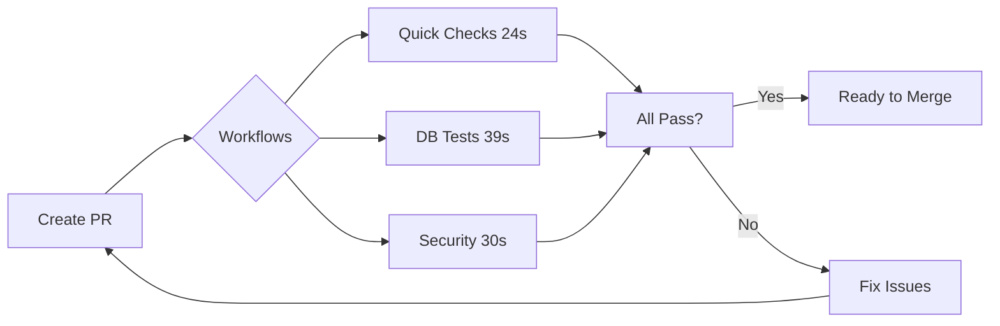

# ✅ CI/CD Setup Checklist

Use this checklist to configure the automated CI/CD pipeline for the Journal app.

## 📋 Pre-Setup

- [ ] Repository is on GitHub
- [ ] You have admin access to the repository
- [ ] Repository has `main` branch

---

## 🔧 GitHub Repository Settings

### 1. Actions Permissions

Go to: **Settings → Actions → General**

- [ ] Set **Workflow permissions** to: **Read and write permissions**
- [ ] Enable: **Allow GitHub Actions to create and approve pull requests**
- [ ] Save changes

### 2. Enable Auto-Merge

Go to: **Settings → General → Pull Requests**

- [ ] ✅ Check: **Allow auto-merge**
  - This allows PRs to be merged automatically when all checks pass
- [ ] ✅ Check: **Automatically delete head branches**
  - Cleans up merged branches automatically
- [ ] Click **Save**

### 3. Branch Protection Rules

Go to: **Settings → Branches → Add rule**

**For `main` branch**:

- [ ] Branch name pattern: `main`
- [ ] ✅ Check: **Require a pull request before merging**
  - [ ] Required approvals: `0` (optional, set to `1` if you want manual review)
  - [ ] ✅ Dismiss stale pull request approvals when new commits are pushed
- [ ] ✅ Check: **Require status checks to pass before merging**
  - [ ] ✅ Require branches to be up to date before merging
  - [ ] Add required status checks (after first workflow runs - see section below):
    - [ ] `Quick Checks` ⚡ (linting, builds - ~24s)
    - [ ] `Database & API Tests` 🧪 (tests, RLS, coverage - ~39s)
    - [ ] `🔍 Secret Detection` 🔒 (required)
    - [ ] `🛡️ Security Scan` 🔒 (required)
    - [ ] `Review Dependencies for Vulnerabilities` 🔍
- [ ] Optional status checks (recommended but non-blocking):
    - [ ] `📦 Bundle Size` (warns on size increases)
    - [ ] `Build & Test Docker Images` 🐳 (only runs when Docker files change)
- [ ] ✅ Check: **Require conversation resolution before merging**
- [ ] ✅ Check: **Do not allow bypassing the above settings**
- [ ] ✅ Check: **Include administrators** (optional but recommended)
- [ ] ❌ Uncheck: **Allow force pushes**
- [ ] ❌ Uncheck: **Allow deletions**
- [ ] Click **Create** or **Save changes**

**📝 Note**: Status checks only appear in the dropdown after they've run at least once. Create a test PR first, then come back to add them.

---

## 🔍 How to Add Status Checks (Detailed Steps)

After creating your first test PR and workflows have run:

1. Go to: **Settings → Branches**
2. Find the rule for `main` branch, click **Edit**
3. Scroll to: **Require status checks to pass before merging**
4. Click the **search box** under "Status checks found in the last week for this repository"
5. Type the job name (e.g., "Quick Checks") and click it to add
6. Repeat for each required check listed above
7. Scroll down and click **Save changes**

**Required checks** (these block merging if they fail):
```
Quick Checks
Database & API Tests
🔍 Secret Detection
🛡️ Security Scan
Review Dependencies for Vulnerabilities
```

**Optional checks** (recommended for notifications, but don't block):
```
📦 Bundle Size
Build & Test Docker Images
```

---

## 🤖 Install Renovate Bot

### Option A: Organization-Level Install (Recommended)

- [ ] Go to: **Organization Settings → GitHub Apps**
- [ ] Search for "Renovate" in GitHub Marketplace
- [ ] Click **Install** or **Configure**
- [ ] Select repositories: Choose this repository or all repositories
- [ ] Grant permissions: Read/write for contents and pull requests
- [ ] Complete installation

### Option B: Repository-Level Install

- [ ] Go to: https://github.com/apps/renovate
- [ ] Click **Install**
- [ ] Select your account/organization
- [ ] Choose: **Only select repositories** → Select your repository
- [ ] Complete installation

**Verify Installation**:
- [ ] Check that Renovate created a "Configure Renovate" PR
- [ ] The existing `renovate.json` configures smart automerge (see below)

---

## 🤖 Renovate Automerge Behavior

The repository is pre-configured with smart automerge in `renovate.json`:

### ✅ Auto-Merges (No Review Needed)
- **Minor updates** (e.g., `react 18.2.0 → 18.3.0`)
- **Patch updates** (e.g., `vite 5.0.1 → 5.0.2`)
- **Security fixes** (all vulnerabilities)
- **GitHub Actions** (e.g., `actions/checkout@v5 → v6`)
- **Lock file maintenance** (weekly on Monday)
- **Grouped updates** (ESLint, TypeScript packages together)

### ❌ Requires Manual Review
- **Major updates** (e.g., `postgres 17 → 18`, `react 18 → 19`)
- **Docker image major versions** (data compatibility risk)
- **Breaking changes** (labeled as `major-update`)

**To disable automerge**, edit `renovate.json`:
```json
{
  "automerge": false
}
```

---

## 📝 Update README Badges (Optional)

The README.md file can have workflow status badges. Add them if desired:

```markdown
[](https://github.com/YOUR_USERNAME/REPO_NAME/actions/workflows/pr-validation.yml)
[](https://github.com/YOUR_USERNAME/REPO_NAME/actions/workflows/security-performance.yml)
```

Replace `YOUR_USERNAME` and `REPO_NAME` with your GitHub username and repository name.

---

## 🧪 Test the Setup

### Test 1: Create a Test PR

- [ ] Create a test branch:
  ```bash
  git checkout main
  git pull
  git checkout -b test-ci-pipeline
  ```

- [ ] Make a small change (e.g., add a comment):
  ```bash
  echo "<!-- CI/CD test -->" >> README.md
  git add README.md
  git commit -m "test: verify CI/CD pipeline"
  git push -u origin test-ci-pipeline
  ```

- [ ] Open PR on GitHub targeting `main`

- [ ] Verify workflows run (should complete in ~1-2 minutes):
  - [ ] `✅ PR Validation` with 2 jobs:
    - [ ] `Quick Checks` (~24s)
    - [ ] `Database & API Tests` (~39s)
  - [ ] `🔒🚀 Security & Performance` with 3 jobs:
    - [ ] `🔍 Secret Detection` (~6s)
    - [ ] `🛡️ Security Scan` (~12s)
    - [ ] `📦 Bundle Size` (~27s)
  - [ ] `🔍 Dependency Review` (~8s)
  - [ ] `🐳 Docker Validation` should **NOT** run (no Docker changes)

- [ ] Verify PR comments appear:
  - [ ] `✅ Validation Results` (unified comment)
  - [ ] `✅ Security & Performance: All Clear`

- [ ] Wait for all checks to pass (green checkmarks)

- [ ] Verify PR can be merged

### Test 2: Verify Branch Protection

- [ ] Try to push directly to `main`:
  ```bash
  git checkout main
  git pull
  echo "test" >> test.txt
  git add test.txt
  git commit -m "test: direct push"
  git push
  ```

- [ ] **Expected**: Push should be rejected with branch protection error ✅

### Test 3: Verify Docker Validation is Conditional

- [ ] Create a PR that modifies `docker-compose.yml`:
  ```bash
  git checkout -b test-docker
  echo "# test comment" >> docker-compose.yml
  git add docker-compose.yml
  git commit -m "test: trigger Docker validation"
  git push -u origin test-docker
  ```

- [ ] Open PR and verify `🐳 Docker Validation` **DOES** run this time

### Test 4: Verify Renovate Automerge

- [ ] Wait 24-48 hours for Renovate to create PRs
- [ ] Check Dependency Dashboard issue for pending updates
- [ ] Verify minor/patch updates have `automerge` enabled
- [ ] Verify major updates are labeled `major-update` (manual review)

---

## 🔍 Add Status Checks to Branch Protection

After first PR runs, add status checks:

1. Go to: **Settings → Branches → Edit rule for `main`**
2. Under "Require status checks to pass before merging", search and add:

**Required (block merging on failure):**
- [ ] `Quick Checks`
- [ ] `Database & API Tests`
- [ ] `🔍 Secret Detection`
- [ ] `🛡️ Security Scan`
- [ ] `Review Dependencies for Vulnerabilities`

**Optional (informational only):**
- [ ] `📦 Bundle Size` (warns but doesn't block)

**Conditional (only add if you want to block on Docker):**
- [ ] `Build & Test Docker Images` (only runs when Docker files change)

3. Click **Save changes**

---

## ⚡ Workflow Performance Expectations

After optimization, expect these timings:

| PR Type | Total Time | Details |
|---------|------------|---------|
| **Typical PR** (code only) | **~1 min** | Quick checks + DB tests + security (all parallel) |
| **Docker PR** (Dockerfile changes) | **~3 min** | Above + Docker validation |
| **Renovate PR** (minor/patch) | **~1 min + auto-merge** | Merges automatically after checks |

**Before optimization:** 6-7 minutes (sequential, duplicate work)
**After optimization:** 1-2 minutes (parallel, no duplicates)
**Improvement:** 80-85% faster ⚡

---

## 📊 Optional: Enable GitHub Insights

- [ ] Go to: **Insights → Community Standards**
- [ ] Check completion status
- [ ] Add any recommended files (CODE_OF_CONDUCT, CONTRIBUTING, etc.)

---

## ✅ Final Verification

Run through this checklist to confirm everything works:

- [ ] PRs to `main` trigger all validation workflows
- [ ] Workflows complete in ~1-2 minutes (typical PR)
- [ ] Status checks appear on PRs
- [ ] Consolidated comments are posted on PRs
- [ ] Direct pushes to `main` are blocked
- [ ] Renovate Bot is creating PRs (may take 24-48h)
- [ ] Minor/patch dependency updates have automerge enabled
- [ ] Major updates require manual review
- [ ] Docker validation only runs when Docker files change

---

## 🎉 Setup Complete!

If all items are checked, your optimized CI/CD pipeline is fully operational!

### What Happens Now?

1. **Development**: Create feature branches, make changes
2. **Pull Request**: Create PR to `main`
3. **Validation**: All checks run automatically (~1-2 min)
4. **Merge**: Merge manually or let Renovate auto-merge dependency updates
5. **Deployment**: Coolify deploys to production automatically
6. **Dependencies**: Renovate updates dependencies automatically

### Workflow Summary



**Total time:** ~40s (parallel execution)

---

## 📚 Documentation

- **Detailed workflow guide**: See `WORKFLOWS.md`
- **Setup and configuration**: See `CICD-SETUP.md`
- **Security configuration**: See `.gitleaks.toml` and `.semgrep.yml`
- **Renovate config**: See `renovate.json`
- **Developer guide**: See `CLAUDE.md`

---

## 🆘 Troubleshooting

If something doesn't work:

### Workflows Not Running
1. Check **Actions** tab for errors
2. Verify **Settings → Actions → General** has correct permissions
3. Check workflow YAML syntax is valid

### Status Checks Not Appearing
1. Make sure workflows have run at least once
2. Check job names match exactly (case-sensitive)
3. Wait 5-10 minutes after workflow completes

### Auto-Merge Not Working
1. Verify **Settings → General → Pull Requests → Allow auto-merge** is enabled
2. Check that `renovate.json` has `"automerge": true`
3. Ensure status checks are passing
4. Check PR labels (major updates won't auto-merge)

### Docker Validation Always Running
1. Check that `docker-validation.yml` has correct `paths:` filter
2. Verify file paths in filter match your Docker files
3. Check workflow syntax is valid

### Branch Protection Not Working
1. Verify rule is saved correctly
2. Check that "Include administrators" is enabled (if you want it to apply to admins)
3. Ensure status check names are spelled exactly right

---

## 📞 Getting Help

- Review workflow logs in **Actions** tab
- Check `WORKFLOWS.md` for technical details
- Review `CLAUDE.md` for development guidelines
- Check GitHub Actions documentation: https://docs.github.com/en/actions

---

**Setup Date**: ___________
**Setup By**: ___________
**Status**: ⬜ In Progress / ✅ Complete

**Optimization Status**: ⬜ Not Applied / ✅ Optimized (60-85% faster)
